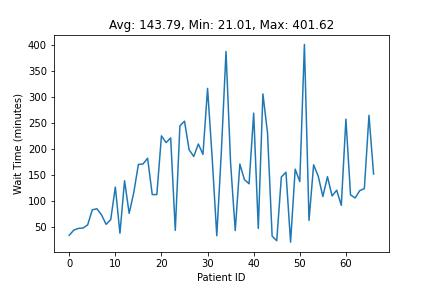
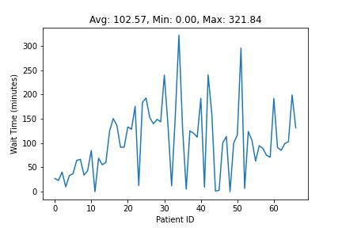
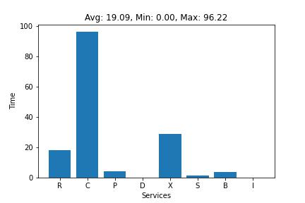
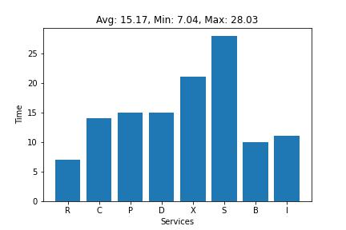
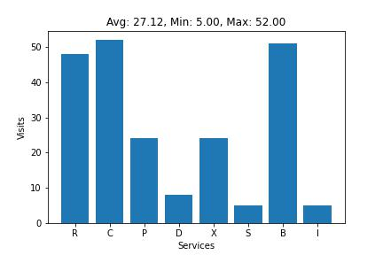

# Simulation file Strucuture 

- simulation_0 - Baseline simulation according to given data
- simulation_1 - Direct dressing after billing, without going to pharmacy
- simulation_2 - Seperate billing for pharmacy
- simulation_3 - IP patients come in only when there is low OP in xray and scan
- simulation_4 - 2 Doctors working in service hours between 08:00 am to 01:00 pm and 8:00 to 5:00 pm
- simulation_5 - 2 Doctors working in service hours between 08:00 am to 1:00 pm and 10:00 to 5:00 pm

# Steps to run the simulation

    cd hospital_simulation
    python ./simulation_0.py

# Results

Processing time per patient

Wait time per patient

Wait time per service

Processing time per service

Number of visits per service

